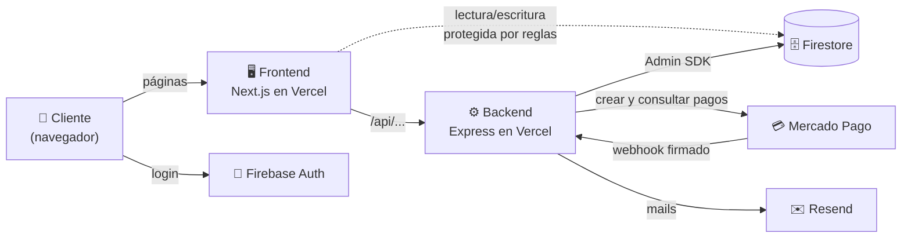
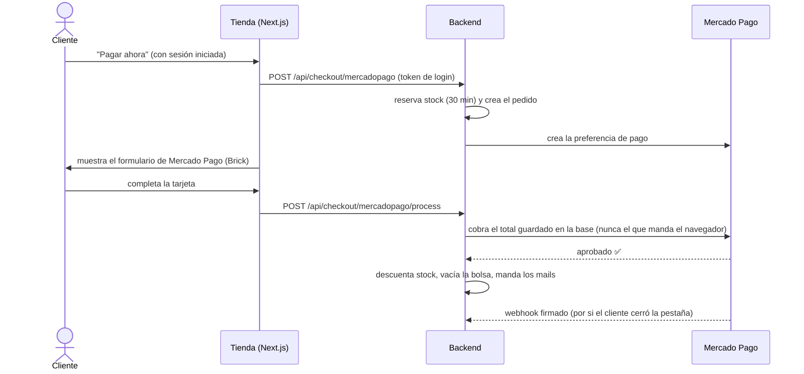

# 👞 Zapatería Genaro — la tienda online

> *Calzado artesanal argentino, ahora también a un clic de distancia.*
> Porque los buenos zapatos se hacen a mano… pero el carrito de compras, mejor que lo haga el código.

🌐 **Sitio en vivo:** [genarozapateria.vercel.app](https://genarozapateria.vercel.app)
🛠️ **API:** [zapateria-genaro-api.vercel.app/api/health](https://zapateria-genaro-api.vercel.app/api/health)

> 🚧 **Estado actual: "Estamos preparando la tienda".**
> El catálogo, el login y el panel de administración funcionan, pero **los pagos están cerrados a propósito**
> hasta el lanzamiento. Mercado Pago corre con credenciales de **prueba**. Nadie puede comprar (ni con plata
> de verdad ni con plata de mentira) hasta que el dueño abra la tienda. Ver [Abrir la tienda](#-abrir-la-tienda-el-gran-día).

---

## 📚 Índice

- [¿Qué es esto?](#-qué-es-esto)
- [Qué puede hacer](#-qué-puede-hacer)
- [Cómo está armado](#-cómo-está-armado)
- [Stack](#-stack)
- [Estructura del repo](#-estructura-del-repo)
- [Levantarlo en tu compu](#-levantarlo-en-tu-compu)
- [Variables de entorno](#-variables-de-entorno)
- [Scripts útiles](#-scripts-útiles)
- [Cómo viaja un pago](#-cómo-viaja-un-pago)
- [Estados de un pedido](#-estados-de-un-pedido)
- [Deploy](#-deploy)
- [Seguridad](#-seguridad)
- [Abrir la tienda (el gran día)](#-abrir-la-tienda-el-gran-día)
- [Tests](#-tests)
- [Preguntas frecuentes](#-preguntas-frecuentes)

---

## 🤔 ¿Qué es esto?

Es el e-commerce de **Zapatería Genaro**, una marca argentina de calzado artesanal: botas, mocasines,
zapatos y zapatillas para hombre y mujer. Los precios están en **pesos argentinos (ARS)** y se paga con
**Mercado Pago**, como corresponde en estas tierras.

El repo tiene dos proyectos que conviven como buenos vecinos:

| Carpeta | Qué es | Dónde vive |
|---|---|---|
| [`frontend/`](frontend) | La vidriera: Next.js 16 + React 19 + Tailwind v4 | Vercel → `genarozapateria.vercel.app` |
| [`functions/`](functions) | La trastienda: API Express + TypeScript | Vercel → `zapateria-genaro-api.vercel.app` |

Y los dos comparten la misma base de datos: **Firebase Firestore**.

> 🧐 ¿Por qué la carpeta del backend se llama `functions/` si no usa Firebase Functions? Historia de amor
> truncada: la idea era migrar a Cloud Functions, pero Firebase pide el plan pago (Blaze) hasta para
> una sola función. Terminó en Vercel (plan gratuito, sin tarjeta) y el nombre quedó como recuerdo.

---

## ✨ Qué puede hacer

**Para quien compra 🛍️**
- Catálogo completo, filtrado por **Hombre** y **Mujer**, con buscador.
- Ficha de producto con fotos, **color y talle** (y stock real por variante).
- Bolsa de compras que se acuerda de vos aunque cierres la pestaña.
- Cuenta propia con **email y contraseña** o **Google**.
- "Mi perfil": dirección, teléfono y el historial de tus pedidos (con el cartelito de **Enviado** 🚚).
- Pago **dentro del sitio** con Mercado Pago (Checkout Bricks): tarjeta, cuotas, dinero en cuenta.
- Mail de **"¡Gracias por tu compra!"** con el detalle del pedido.

**Para quien vende 🧑‍💼** (panel `/admin`, solo para usuarios con rol `admin`)
- Alta, edición y baja de productos, con variantes de talle, color y stock.
- Pedidos pagados: editar, **marcar como enviado** o archivar.
- Archivo histórico con buscador (completados, cancelados, fallidos, reembolsados).
- Aviso por mail de **"Nueva venta"** cada vez que entra un pedido.

**Detrás de escena 🧠**
- **Reserva de stock**: mientras alguien está pagando, esas unidades quedan apartadas para que nadie más
  se las lleve. Si no paga en **30 minutos**, se liberan solas.
- **Webhooks** de Mercado Pago con firma verificada: el pago se confirma aunque el cliente cierre el navegador.
- Todo idempotente: si el pago llega por dos caminos, el stock se descuenta **una sola vez**.

---

## 🏗️ Cómo está armado



- El **frontend** habla con el backend para el catálogo, el carrito y los pagos.
- El **panel de admin** y "Mi perfil" leen Firestore directamente, y ahí mandan las
  [reglas de seguridad](firestore.rules): cada quien ve lo suyo, y solo el admin toca el catálogo y los pedidos.
- El **backend** usa el Admin SDK (con acceso total) y es el único que crea pedidos, cobra y descuenta stock.

---

## 🧰 Stack

| Capa | Tecnología |
|---|---|
| Frontend | Next.js 16 (App Router, Turbopack) · React 19 · Tailwind CSS v4 · lucide-react |
| Backend | Node 22 · Express 5 · TypeScript · helmet · express-rate-limit |
| Datos | Firebase Firestore · Firebase Auth (email/contraseña + Google) |
| Pagos | Mercado Pago Checkout Bricks (principal) · PayPal (apagado, ver abajo) |
| Mails | Resend |
| Errores | Sentry (frontend y backend) |
| Hosting | Vercel (dos proyectos: `genio26` y `zapateria-genaro-api`) + Vercel Firewall |
| Tests | Vitest (+ Testing Library en el frontend) |

---

## 🗂️ Estructura del repo

```
.
├── frontend/                 # 🖥️ La tienda (Next.js)
│   └── src/
│       ├── app/              # Páginas: /, /collections, /products/[id], /cart, /checkout/*, /admin, /profile...
│       ├── components/       # Header, carrito lateral, Brick de Mercado Pago, etc.
│       ├── context/          # AuthContext (login + perfil) y CartContext (bolsa)
│       └── lib/              # api.ts (cliente del backend), firebase.ts, types.ts
├── functions/                # ⚙️ La API (Express)
│   └── src/
│       ├── routes/           # /api/shoes, /api/carts, /api/checkout, /webhooks
│       ├── controllers/      # Capa HTTP finita: valida y delega
│       ├── services/         # Toda la lógica: pedidos, stock, Mercado Pago, mails
│       ├── middlewares/      # requireUser / requireAdmin, manejo de errores
│       ├── config/           # env, Firebase Admin, Mercado Pago, PayPal, Sentry
│       └── scripts/          # seed del catálogo, alta del admin, chequeos de pagos
├── firestore.rules           # 🔒 Reglas de seguridad de la base (versionadas acá)
├── firebase.json             # Config para desplegar esas reglas
├── resources/                # Fotos originales del catálogo
└── .secrets/                 # 🙈 Claves locales (ignorada por git, nunca se sube)
```

---

## 💻 Levantarlo en tu compu

**Necesitás:** Node **22**, npm, y acceso al proyecto de Firebase `sun-66f` (pedíselo al dueño).

```bash
git clone https://github.com/andresListorti/Genio26.git
cd Genio26

npm install --prefix functions
npm install --prefix frontend
```

**Las claves** (nunca van en el código ni en el chat):

1. Descargá una clave de la cuenta de servicio de Firebase
   (*Consola de Firebase → Configuración del proyecto → Cuentas de servicio → Generar nueva clave privada*)
   y guardala como **`.secrets/firebase-admin.json`** en la raíz del repo. El backend la busca ahí solo.
2. Creá **`functions/.env`** y **`frontend/.env.local`** con las variables de [la tabla de abajo](#-variables-de-entorno).

**¡A caminar!** 👟 En dos terminales:

```bash
npm run dev --prefix functions   # API en http://localhost:3000
npm run dev --prefix frontend    # Tienda en http://localhost:3001
```

¿Base vacía? `npm run seed --prefix functions` carga el catálogo de ejemplo.
¿Necesitás un admin? Poné `ADMIN_EMAIL` y `ADMIN_PASSWORD` en `functions/.env` y corré
`npm run seed:admin --prefix functions`.

---

## 🔑 Variables de entorno

> Solo los **nombres**. Los valores reales viven en Vercel (producción) y en tus archivos locales ignorados.

**Backend — `functions/.env` y Vercel (`zapateria-genaro-api`)**

| Variable | Para qué |
|---|---|
| `CHECKOUT_ENABLED` | 🔒 **Llave maestra de pagos.** Sin `true`, la tienda no cobra. |
| `PAYPAL_ENABLED` | Llave de PayPal (además necesita `CHECKOUT_ENABLED`). |
| `FRONTEND_URL` · `CORS_ORIGINS` | Dónde vive la tienda y quién puede llamar a la API. |
| `FIREBASE_PROJECT_ID` · `FIREBASE_CLIENT_EMAIL` · `FIREBASE_PRIVATE_KEY` | Admin SDK en producción (en local se usa `.secrets/firebase-admin.json`). |
| `MERCADOPAGO_ACCESS_TOKEN` · `MERCADOPAGO_PUBLIC_KEY` · `MERCADOPAGO_WEBHOOK_SECRET` | Mercado Pago (hoy: credenciales de prueba). |
| `RESEND_API_KEY` · `RESEND_FROM_EMAIL` · `RESEND_ADMIN_EMAIL` | Mails de confirmación y aviso de venta. |
| `PAYPAL_CLIENT_ID` · `PAYPAL_CLIENT_SECRET` · `PAYPAL_API_URL` · `PAYPAL_FALLBACK_CURRENCY` · `PAYPAL_ARS_PER_USD` | PayPal (apagado). |
| `SENTRY_DSN` | Reporte de errores. |
| `ADMIN_EMAIL` · `ADMIN_PASSWORD` | Solo local, para `seed:admin`. |

**Frontend — `frontend/.env.local` y Vercel (`genio26`)**

| Variable | Para qué |
|---|---|
| `NEXT_PUBLIC_API_BASE_URL` | URL del backend. |
| `NEXT_PUBLIC_APP_URL` | URL pública de la tienda (metadatos). |
| `NEXT_PUBLIC_FIREBASE_*` | Configuración web de Firebase (es pública por diseño; la protección real son las reglas). |
| `NEXT_PUBLIC_SENTRY_DSN` | Reporte de errores (vacío = apagado). |

---

## 🧪 Scripts útiles

| Comando (desde la raíz) | Qué hace |
|---|---|
| `npm run dev` | Levanta la API con recarga en caliente. |
| `npm run test` | Tests del backend. |
| `npm run typecheck` | Chequeo de tipos del backend. |
| `npm run seed` | Carga el catálogo de ejemplo en Firestore. |
| `npm run seed:admin` | Crea o actualiza el usuario administrador (lee `ADMIN_EMAIL` / `ADMIN_PASSWORD`). |
| `npm run check:mercadopago` | Verifica que las credenciales de Mercado Pago anden. |
| `npm run verify` | Tipos + tests + chequeos de pagos, todo junto. |
| `npm run deploy` | Despliega el backend a producción en Vercel. |

En `frontend/`: `npm run dev`, `npm run build`, `npm run lint`, `npm run test`.

---

## 💳 Cómo viaja un pago



Tres reglas de oro que el backend no negocia:
1. **El precio lo pone la base de datos**, no el navegador.
2. **Si lo cobrado no alcanza el total**, el pedido no se despacha (queda como `FAILED / amount_mismatch`).
3. **Cada quien paga lo suyo**: hace falta sesión iniciada y el pedido tiene que ser tuyo.

---

## 🚦 Estados de un pedido

| Estado | Significa |
|---|---|
| `CREATED` | Se inició el pago; el stock está reservado (máximo 30 minutos). |
| `APPROVED` | Pago en proceso o acreditándose (por ejemplo, pago en efectivo). Se respeta la reserva. |
| `COMPLETED` | 🎉 Pagado: stock descontado, bolsa vaciada, mails enviados. |
| `FAILED` | Rechazado, vencido (`expired`) o con monto insuficiente (`amount_mismatch`). |
| `CANCELLED` | Archivado por el admin. |
| `REFUNDED` | Devuelto. |

Que un pedido **ya salió** no es un estado: es el campo `shippedAt`, que se marca con el camioncito 🚚 en `/admin/orders`.

---

## 🚀 Deploy

- **Frontend:** se despliega solo en cada push a `main` (proyecto Vercel `genio26`).
- **Backend:** a mano, desde `functions/`:
  ```bash
  cd functions && vercel deploy --prod
  ```
  `functions/.vercelignore` evita que se suban los `.env` locales. Si alguna vez hiciste un
  `vercel rollback`, los deploys nuevos **no se publican solos**: probalos y después `vercel promote <url>`.
- **Reglas de Firestore:**
  ```bash
  firebase deploy --only firestore:rules --project sun-66f
  ```

> ⚠️ `firebase-admin` se queda en la **v13** a propósito: la v14 se rompe en Vercel (un módulo ESM choca con Sentry).

---

## 🛡️ Seguridad

Resumen de lo que protege a la tienda (auditado en septiembre de 2026):

- 🔒 **Reglas de Firestore** reales: nadie lee datos ajenos, nadie se autoasigna el rol de admin, el
  catálogo y los pedidos solo los toca el admin. Los carritos son exclusivos del backend.
- 🔑 **Secretos fuera del repo**: solo en variables de Vercel y en `.secrets/` (ignorada). Todas las
  credenciales que alguna vez se expusieron fueron **rotadas**.
- 💳 **Pagos blindados**: login obligatorio, precio del servidor, control de monto, webhooks firmados,
  reservas que vencen, y una llave maestra (`CHECKOUT_ENABLED`) para cerrar todo.
- 🧱 **Vercel Firewall**: máximo 10 intentos de pago por minuto por IP.
- 🕵️ **Respuestas públicas sin datos personales**: la consulta de un pedido devuelve número, estado y total, nada más.
- 🧢 **Cabeceras de seguridad** (HSTS, anti-iframe, nosniff, CSP). La CSP completa está en modo
  observación hasta el lanzamiento.
- 🚫 **PayPal apagado**: corría en modo sandbox, y eso permitía "pagar" con plata de mentira.

¿Encontraste algo raro? Escribile al dueño del repo **en privado**, no en un issue público. 🙏

---

## 🎉 Abrir la tienda (el gran día)

La checklist para pasar de "estamos preparando la tienda" a "¡bienvenidos!":

1. [ ] **Dominio propio verificado en Resend**, para que los mails lleguen a los clientes
   (hoy salen de `onboarding@resend.dev` y solo llegan a la cuenta dueña).
2. [ ] **Probar la CSP completa**: con la tienda en modo prueba, hacer login con Google y una compra
   de prueba, revisar la consola del navegador y pasar `Content-Security-Policy-Report-Only` a
   `Content-Security-Policy` en `frontend/vercel.json`.
3. [ ] **Credenciales de producción de Mercado Pago** en Vercel (`MERCADOPAGO_ACCESS_TOKEN`,
   `MERCADOPAGO_PUBLIC_KEY`, `MERCADOPAGO_WEBHOOK_SECRET`).
4. [ ] **`CHECKOUT_ENABLED=true`** en el backend y redeploy.
5. [ ] Una compra real chiquita, de punta a punta, para celebrar. 🥂

---

## ✅ Tests

```bash
npm test --prefix functions   # backend: pedidos, stock, pagos, mails, candado, permisos
npm test --prefix frontend    # frontend: AuthContext y CartContext
```

El backend nunca toca la base real en los tests: usa una Firestore falsa en memoria (`src/test-utils/fakeFirestore.ts`).

---

## ❓ Preguntas frecuentes

**¿Por qué no puedo comprar?**
Porque la tienda todavía no abrió. Es a propósito. Volvé pronto. 😉

**¿Por qué el repo se llama `Genio26`?**
Porque todo proyecto empieza con un nombre en clave, y a veces el nombre en clave se queda a vivir.

**¿La configuración de Firebase que está en el frontend no es un secreto?**
No: está pensada para ser pública. Lo que protege los datos son las reglas de Firestore.

**¿Y PayPal?**
Está apagado. Cuando haya una cuenta PayPal Business real, se enciende con `PAYPAL_ENABLED=true`.

---

<p align="center">Hecho con ❤️, mate 🧉 y muchos pares de zapatos probados en Argentina.</p>
